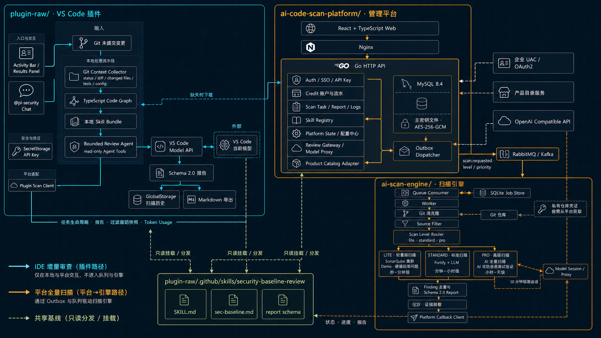
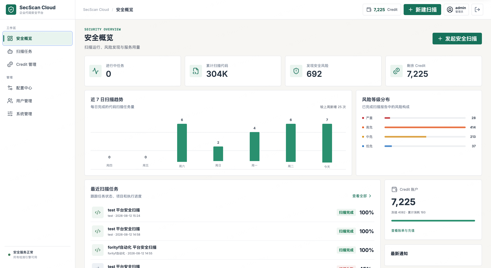
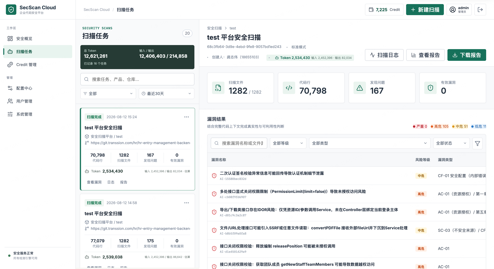
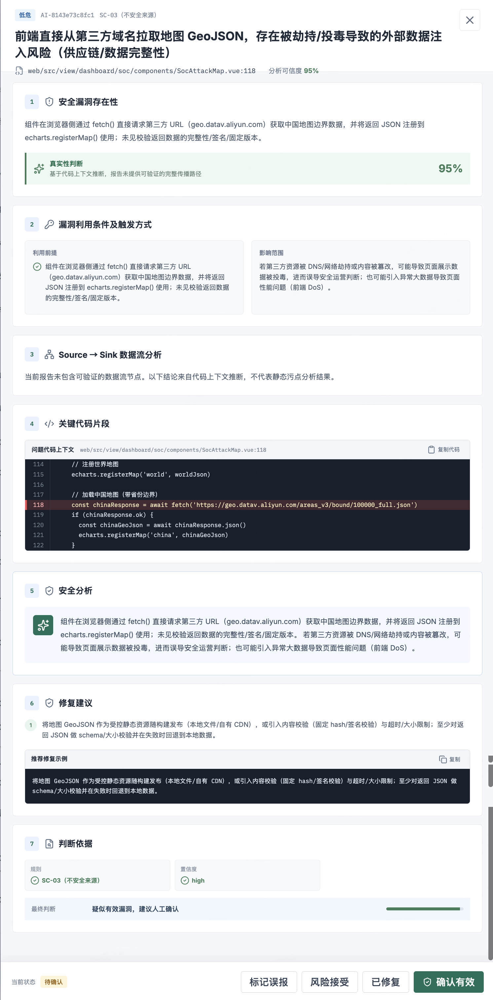
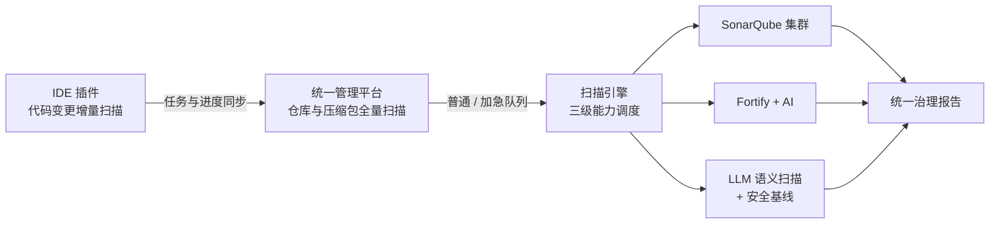
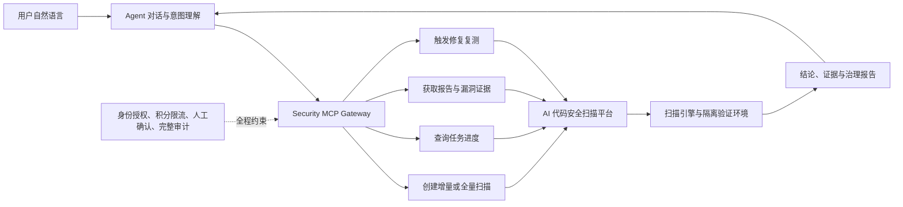
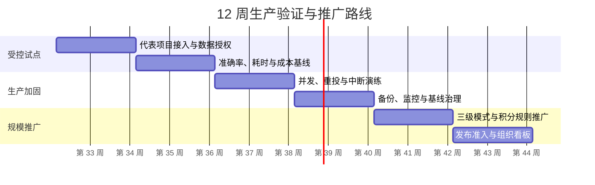

# AI 代码安全扫描平台全景报告

> 项目全景报告 · 2026 年 8 月

> [!IMPORTANT]
> ## 核心结论
>
> 以 IDE 插件承接增量扫描，以统一平台承接全量扫描，把风险发现、资源调度、积分消耗与治理报告纳入同一条管理闭环。由集团安全部封装提供代码安全能力，赋能全公司提高代码安全水准。将传统不可见的安全能力开放给全体员工按需使用，增强安全意识和代码安全能力，减少漏洞风险面，降低修复漏洞成本。
>
> **项目阶段：** MVP 完整，生产准备中。核心业务链路与治理机制已经成型，下一步重点是真实团队、真实仓库和真实流量下的准确率、稳定性与成本验证。若验证通过，将完善底层框架体系。

*技术架构图*

## 01 执行摘要

> 不是再增加一套安全工具，而是建立一条可进入研发日常、可被组织治理的代码安全工作流。

开发者通过 IDE 插件完成代码变更增量扫描；团队通过平台发起仓库级全量扫描。轻量、标准与 Release 三级模式分别匹配演示验证、日常研发和上线前全面审查，最终统一生成符合传音内部治理要求的标准化报告。

| 对业务 | 对研发 | 对管理 |
| --- | --- | --- |
| 在发布前暴露高风险问题，降低返工与事故处置成本。 | 增量与全量扫描按场景协同，任务进度实时同步。 | 通过积分、优先级和队列统一治理集团扫描资源。 |

*平台界面*

*扫描任务界面*

> [查看飞书文档中的插件扫描演示视频](https://transsioner.feishu.cn/docx/MpLudT68wo4JEzxCOzQc2IYZnFd)

### 当前工程事实

| 指标 | 当前事实 | 说明 |
| --- | --- | --- |
| 协同产品端 | **3** | VS Code 插件、管理平台、扫描引擎 |
| 标准扫描阶段 | **6** | 从基线加载到报告与研判 |
| 数据库迁移 | **15 组** | 覆盖账号、账本、任务、队列与凭据 |
| 核心测试文件 | **28 个** | 平台 20、引擎 6、插件 2 |

*单条漏洞报告*

## 02 一套平台，三类价值

### 研发与项目成员

- **低门槛进入日常：** 从活动栏、命令面板或文件右键直接发起审查，不改变主要工作环境。
- **结果可直接行动：** 输出严重等级、文件位置、影响、依据与修复建议，减少从发现到修改的跳转。
- **范围自主可控：** IDE 覆盖暂存、未暂存和未跟踪变更；平台支持目录、模式与漏洞类型过滤。

### 安全与运营人员

- **统一检测基线：** 插件与引擎共享安全基线，集中维护证据要求和严重性标准。
- **完整研判闭环：** 支持有效、误报、风险接受和已修复状态，并呈现 Source → Sink 证据。
- **任务过程可观测：** 记录阶段、进度、文件数、代码行、执行日志和报告。

### 管理层

- **集团并发可治理：** 积分余额、预冻结、消耗流水和计费规则共同约束资源占用。
- **扫描策略可配置：** 集中管理 SonarQube、Fortify、AI / LLM、消息投递和三级模式，支持加急插队。
- **风险可度量：** 任务、漏洞等级、人工研判和报告形成统一数据入口。

## 03 产品与技术全景

**Developer Edge：** IDE 插件围绕当前代码变更快速审查，并把任务阶段与进度同步到平台。

**Control Plane：** 管理平台承接仓库级任务、积分扣减、加急插队、实时进度、漏洞研判和报告管理。

**Execution Plane：** 扫描引擎按模式调度 SonarQube、Fortify、AI 与 LLM，兼顾吞吐、质量和发布保障。

**技术栈：** TypeScript 6、VS Code Extension API、React、Go 1.26、MySQL 8.4、RabbitMQ、Kafka、SQLite、OpenAI Compatible API、Docker Compose。

*平台扫描*

## 04 双入口，三级扫描模式

| 模式 | 适用阶段 | 主要能力 | 目标 |
| --- | --- | --- | --- |
| **轻量级** | Demo / MVP | SonarQube 集群 | 快速反馈、较低资源占用 |
| **标准级（推荐）** | 日常研发审查 | Fortify + AI | 兼顾规则确定性、上下文与效率 |
| **Release 级** | 发版上线前 | LLM 语义扫描 + 安全基线 | 全面审查、发布准入与风险确认 |

### 标准扫描流程

1. **加载基线：** 确定本次检查标准。
2. **收集上下文：** 过滤代码与配置范围。
3. **风险初筛：** 以确定性规则快速发现问题。
4. **AI 深度审计：** 分批分析数据流和上下文证据。
5. **去重校验：** 拒绝虚构路径和行号。
6. **报告与研判：** 回传、确认、修复并形成闭环。

> [!TIP]
> **任务治理：** 插件与平台任务在统一平台实时同步进度；加急任务支持插队；所有模式按规则消耗积分，以积分配额约束全集团并发量。

## 05 当前能力清单

| 能力域 | 当前实现 | 状态 |
| --- | --- | --- |
| 开发现场审查 | Git 变更收集、上下文截断、多轮只读分析、本地结果与导出 | 已实现 |
| 双扫描入口 | IDE 增量扫描；平台面向 Git 仓库或代码压缩包全量扫描 | 已实现 |
| 三级扫描模式 | 轻量：SonarQube；标准：Fortify + AI；Release：LLM + 安全基线 | 已实现 |
| 异步任务调度 | 普通 / 加急通道、插队、RabbitMQ / Kafka、Outbox 重试和进度回传 | 已实现 |
| 漏洞研判 | 等级与类型筛选、AI 判断依据、Source → Sink 和处置状态 | 已实现 |
| 积分与并发 | 余额、预冻结与流水；以积分配额控制集团级并发占用 | 已实现 |
| 治理报告 | 统一证据、严重性、研判和修复要求 | 已实现 |
| 生产运营 | 容量基线、可用性目标、告警阈值、备份恢复与灰度准入 | 待验证与固化 |
| 组织级度量 | 覆盖率、修复周期、误报率、发布拦截与成本效率看板 | 下一阶段 |

## 06 安全治理设计

### 最小化源码范围

只保留代码、依赖清单、容器 / IaC 与安全配置，排除文档、媒体、构建产物和二进制文件。

### 凭据分层保护

接入密钥仅存哈希；模型密钥采用 AES-256-GCM；插件凭据进入 VS Code SecretStorage。

### 远程内容网络约束

仅接受 HTTPS，拒绝 URL 凭据、私网、Loopback 与 Link-local，并限制重定向和内容大小。

### 模型输出不盲信

源码按不可信数据处理；严格解析结构化结果；仅接受已提交文件与真实行号。

### 身份与所有权校验

任务身份从服务端会话读取，服务端校验任务所有权与状态转换。

### 关键动作完整留痕

任务阶段和报告进入任务日志，积分变化形成账本流水，支持审计与追责。

> [!NOTE]
> **统一治理报告：** 不同入口和扫描模式最终收敛到统一报告要求，确保漏洞证据、等级、研判、修复与审计信息符合传音内部治理规范。

## 07 工程现状与成熟度

### 已具备的工程证据

- 插件版本 0.0.16，包含结果面板、聊天参与者、报告导出与平台接入密钥。
- 平台拥有 15 组数据库迁移，覆盖账户、Credit、扫描进度、报告、源码快照、队列与仓库凭据。
- 任务支持普通 / 加急调度、插队、幂等重试和实时进度回传。
- 核心测试覆盖认证、密钥、模型代理、报告、扫描、队列、分析器与插件源码过滤。
- 本地 Web 管理平台和 API 已可运行，配置、任务、用户和 Credit 流程已有交互入口。

> [!WARNING]
> **成熟度判断：MVP 完整，生产准备中。**
>
> 功能完整度较高，安全设计覆盖关键边界；运营指标尚待建立基线，生产韧性尚待真实演练。

### 三类重点风险

1. **准确性与采用率：** 若误报率偏高或结果无法行动，功能完整也难以形成持续使用。
2. **容量、重试与恢复：** 需验证并发任务、重复投递、模型超时、平台中断和密钥丢失场景。
3. **规则与模型迭代：** 基线需要版本、审批、灰度、回滚和效果对比机制。

## 08 未来能力：Agent 安全执行面

> [!NOTE]
> **规划中：** 未来将通过 MCP 向 Agent 暴露受控安全能力，并以隔离 Kali 虚拟机完成灰盒、黑盒渗透与漏洞修复复测。本节不代表当前已经上线。

### MCP：在 Agent 对话中完成安全任务

用户可通过自然语言发起扫描、查询进度、研判漏洞证据和验证修复。MCP 作为受控能力网关，不向 Agent 直接暴露平台密钥或虚拟机控制权。

#### MCP 治理边界

- **身份与项目授权：** 每次调用继承用户身份，只允许访问明确授权的项目和任务。
- **高风险动作确认：** 渗透验证需明确目标、环境、时间窗、允许动作和停止条件。
- **资源治理：** 调用受积分、限流、优先级和并发策略约束。
- **审计留痕：** 记录对话意图、工具参数、执行状态、证据与最终结论。

### Kali：灰盒与黑盒渗透复测

针对已确认漏洞或授权目标，平台自动启动一次性隔离 Kali 虚拟机，在受控网络与时间窗口内执行验证，以可复现证据判断修复是否真正生效。

| 步骤 | 执行内容 | 关键控制 |
| --- | --- | --- |
| **1. 确认授权边界** | 确定目标、环境、时间窗和允许动作 | 人工确认与停止条件 |
| **2. 启动隔离 Kali** | 创建一次性虚拟机并预置验证工具 | 网络隔离、最小权限、全程审计 |
| **3. 灰盒 / 黑盒验证** | 灰盒携带受限上下文；黑盒模拟外部攻击面 | 仅在授权范围执行 |
| **4. 采集可复现证据** | 记录请求响应、攻击路径、影响范围与环境信息 | 证据脱敏与完整性保护 |
| **5. 修复复测并销毁** | 对比修复前后结果，输出报告后清理环境 | 一次性资产、到期强制销毁 |

> 目标闭环：漏洞发现 → 修复建议 → 代码修复 → 自动渗透复测 → 证据确认 → 风险关闭。

## 09 成效衡量口径

> [!NOTE]
> 当前仓库没有真实经营数据。以下均为建议采集口径，不代表已实现的生产指标；建议从试点首日开始建立基线。

| 指标 | 定义 | 建议公式 |
| --- | --- | --- |
| 风险发现前移率 | 开发 / 合并前发现的有效高危占比 | 前移发现数 ÷ 全部有效高危数 |
| 有效漏洞确认率 | 人工确认有效发现占已研判发现的比例 | 确认有效数 ÷ 已研判发现数 |
| 高危平均修复周期 | 从发现到确认修复的平均时间 | 总修复时长 ÷ 已修复高危数 |
| 扫描覆盖率 | 完成扫描的活跃项目占应纳入项目比例 | 已覆盖项目数 ÷ 应覆盖项目数 |
| 单位有效发现成本 | 模型、计算和运营成本对应的有效发现效率 | 周期总成本 ÷ 确认有效发现数 |
| 平台任务成功率 | 剔除主动取消后，成功生成可用报告的任务比例 | 成功任务数 ÷ 可执行任务数 |

## 10 下一阶段推进路线

### 阶段 1：受控试点（0—4 周）

- 选择 2—3 个技术栈不同的代表项目。
- 明确数据范围、授权人和问题升级路径。
- 逐条研判高危结果，建立误报与漏报样本。
- 记录任务成功率、P95 耗时与单位成本。

### 阶段 2：生产加固（5—8 周）

- 完成并发、重投、超时和服务中断演练。
- 固化主密钥、数据库和报告备份恢复流程。
- 建立 Skill 版本审批、灰度与回滚机制。
- 补齐监控告警、SLA 和运营值班手册。

### 阶段 3：规模推广（9—12 周）

- 按项目阶段配置轻量、标准和 Release 模式。
- 以积分规则控制集团并发与重点任务插队。
- 将 Release 级高可信高危结果接入发布准入。
- 上线组织级覆盖、修复、积分与成本仪表盘。

## 11 需要形成的三项管理共识

1. **批准受控生产试点：** 明确试点团队、仓库范围、数据授权、安全负责人和四周验证周期。
2. **以有效性而非扫描量验收：** 围绕确认率、修复周期、覆盖率、任务成功率和单位成本建立基线。
3. **建立跨部门产品责任组：** 由研发、安全、平台和运维共同负责规则质量、系统稳定、用户采用与风险闭环。

---

**增量扫描进入研发现场，全量扫描守住发布关口，统一报告满足传音内部治理要求。**

材料依据：项目 README、当前产品界面、插件 0.0.16 配置、平台 15 组数据库迁移与核心测试目录。更新日期：2026-08-11。

原始文档：[AI 代码安全扫描平台全景报告（飞书）](https://transsioner.feishu.cn/docx/MpLudT68wo4JEzxCOzQc2IYZnFd)
